# My portfolio UI PART

## Description 

Welcome to my portfolio! This project showcases my work and skills using modern web technologies.

``` mermaid
flowchart TD
 subgraph Frontend["Frontend"]
        Works["Works"]
        Certificates["Certificates"]
  end
 subgraph Firebase["Firebase"]
        Authentication["Authentication"]
        Storage["Storage"]
  end
 subgraph Authentication["Authentication"]
        Git["Git"]
        Google["Google"]
  end
 subgraph Backend["Backend"]
        Express.js["Express.js"]
  end
 subgraph MongoDB["MongoDB"]
        dbWorks["Works"]
        dbCertificates["Certificates"]
        dbUsers["Users"]
  end

    Storage -- Images --> Backend
    Backend -- API --> Frontend
    MongoDB <--> Backend
    Authentication -- IdToken --> Frontend
    Frontend -- IdToken --> Backend
    Backend <-- Cookie(User, JWTtoken) --> Frontend
    Backend <-- verifyIdToken(IdToken) --> Authentication

    classDef animLink stroke-width:3px,stroke-dasharray:5 5,animation: slow
    style Authentication fill:#1E88E5,stroke:#1565C0,stroke-width:2px,rx:10,ry:10
    style Storage fill:#8E24AA,stroke:#6A1B9A,stroke-width:2px,rx:10,ry:10
    style Express.js fill:#424242,stroke:#212121,stroke-width:2px,rx:10,ry:10
    style Backend fill:#FF9800,stroke:#D84315,stroke-width:2px,rx:10,ry:10
    style Frontend fill:#4CAF50,stroke:#388E3C,stroke-width:2px,rx:10,ry:10
    style MongoDB fill:#3794ff85,stroke:#0D8C42,stroke-width:2px,rx:10,ry:10
    style Firebase fill:#ffca2859 ,stroke:#FFB300,stroke-width:2px,rx:10,ry:10
    linkStyle 0 stroke:#FF7043,stroke-width:2px,stroke-dasharray:5 5,fill:none
    linkStyle 2 stroke:#D32F2F,stroke-width:2px,fill:none
    linkStyle 3 stroke:#8E24AA,stroke-width:2px,stroke-dasharray:5 5,fill:none
    linkStyle 5 stroke:#42A5F5,stroke-width:2px,stroke-dasharray:5 5,fill:none

    Backend{ animation: fast }
    Authentication{ animation: slow }
    Frontend{ animation: slow }
    Backend{ animation: slow }
```

## Flowchart 

## Links 

1.  [15 Top ReactJS Carousel Component Libraries](https://www.bacancytechnology.com/blog/react-carousel)
2.  [Swiper use example](https://www.youtube.com/watch?v=KL_yIf5uiJo&ab_channel=TravelsCode)
3.  [Swiper DEMOS](https://swiperjs.com/demos#responsive-breakpoints)
4.  [Using SVG Component](https://www.copycat.dev/blog/react-svg/)
5.  [Form upload file](https://www.filestack.com/fileschool/react/react-file-upload/)
